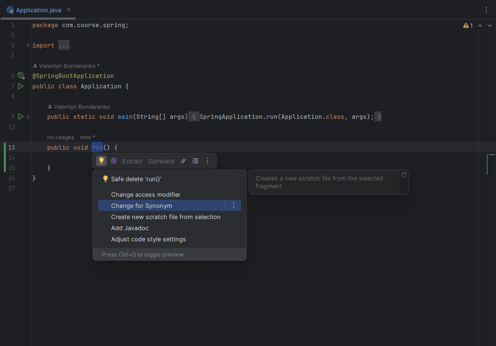
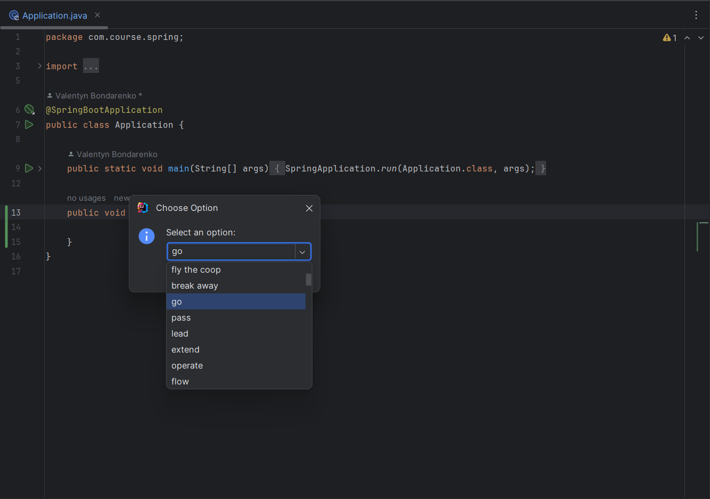
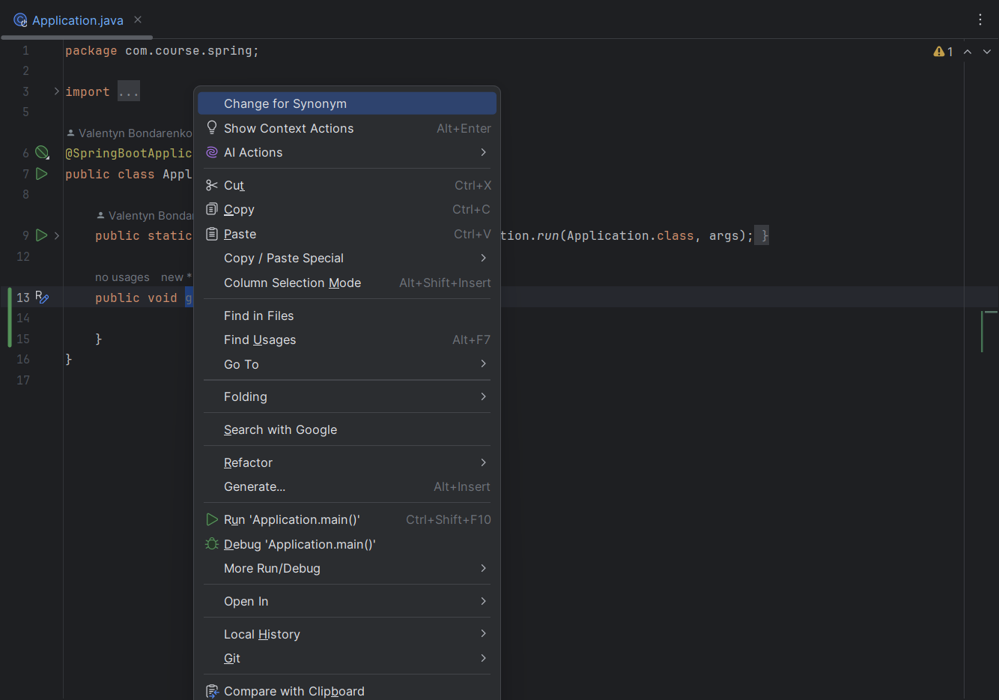
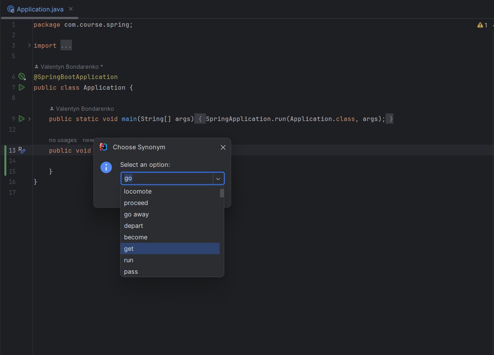

# SynonymsPlugin

## Test task
Implement a plugin for IntelliJ Ultimate that shows synonyms for identifiers in source code. You can achieve this by either using an existing thesaurus (synonym dictionary) or by creating your own and implementing an intention action applicable on identifiers which lists synonyms for the given identifier.

-----------------

## Features
This plugin allows you to change a selected identifier in your codebase andreplace it with a chosen synonym.

### IntentionAction:

1) Select text you would like to change (it should be a single word, otherwise no synonym will be found for the entire phrase).

2) Choose appropriate synonym, you can also input your own new identifier

### Action (another way to use the plugin):
1) Select text you would like to change and right-click on the selection: 

2) The 2nd part is the same as with the intention function:

### Thesaurus:

When I started developing this plugin, I uderstood that it would be difficult to create a sufficiently big thesaurus to be able to use it even in testing. Therefore I decided to use the following strategy for synonym lookups:
1) Check local json file with top 60 terms, if not found, move to the next stage
2) Check if first API has needed list of synonyms, if not, move to the next stage
3)  Check if second API has needed list of synonyms, if not, move to the next stage
4) Mock Thesaurus Service that returns empty list

This pattern allows to find synonym list to almost any possible identifier in English language

### Further improvement ideas:

- sort synonyms by length (shortest first)
- filter out long irrelevant (containing spaces) synonyms
- expand the json file with local thesaurus for better coverage of identifiers
- add multiple Language support (German, Spanish, French, etc) 
- add features of replacing all identifier's occurences in file, package, etc.. 

-------------------

## Installation

- Manually:

  Download the [latest release](https://github.com/Valentine-456/SynonymsPlugin/releases/latest) and install it manually using
  <kbd>Settings/Preferences</kbd> > <kbd>Plugins</kbd> > <kbd>⚙️</kbd> > <kbd>Install plugin from disk...</kbd>

---
Plugin based on the [IntelliJ Platform Plugin Template][template].
<!-- Plugin description -->
**IntelliJ Platform Plugin Template** is a repository that provides a pure template to make it easier to create a new plugin project (check the [Creating a repository from a template][gh:template] article).
This Fancy IntelliJ Platform Plugin is going to be your implementation of the brilliant ideas that you have.

[gh:template]: https://docs.github.com/en/repositories/creating-and-managing-repositories/creating-a-repository-from-a-template
To keep everything working, do not remove `<!-- ... -->` sections.
<!-- Plugin description end -->
[template]: https://github.com/JetBrains/intellij-platform-plugin-template
[docs:plugin-description]: https://plugins.jetbrains.com/docs/intellij/plugin-user-experience.html#plugin-description-and-presentation
